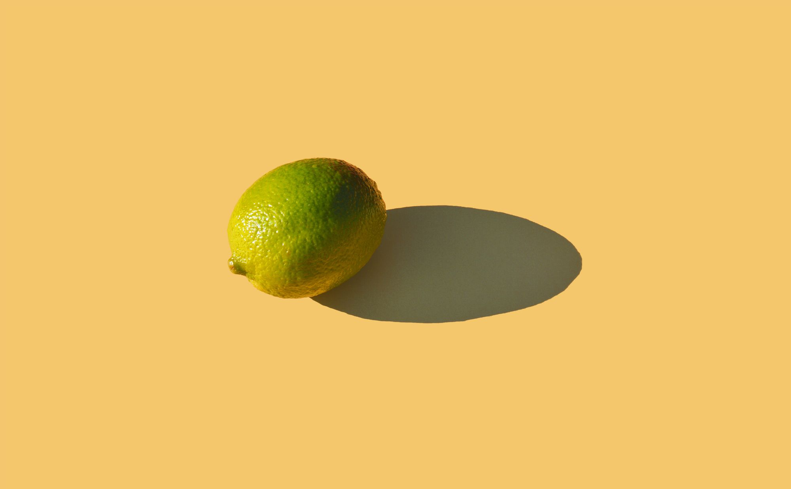

### Picasso had his pink period and his blue period. I am in my blonde period right now.

When I first started wearing pink, it wasn't nothing I planned on doing or strategized. But people showed me so much love for the pink mink I wore, I had to go out to Pantone and create my own color, which is called Killa Pink.

